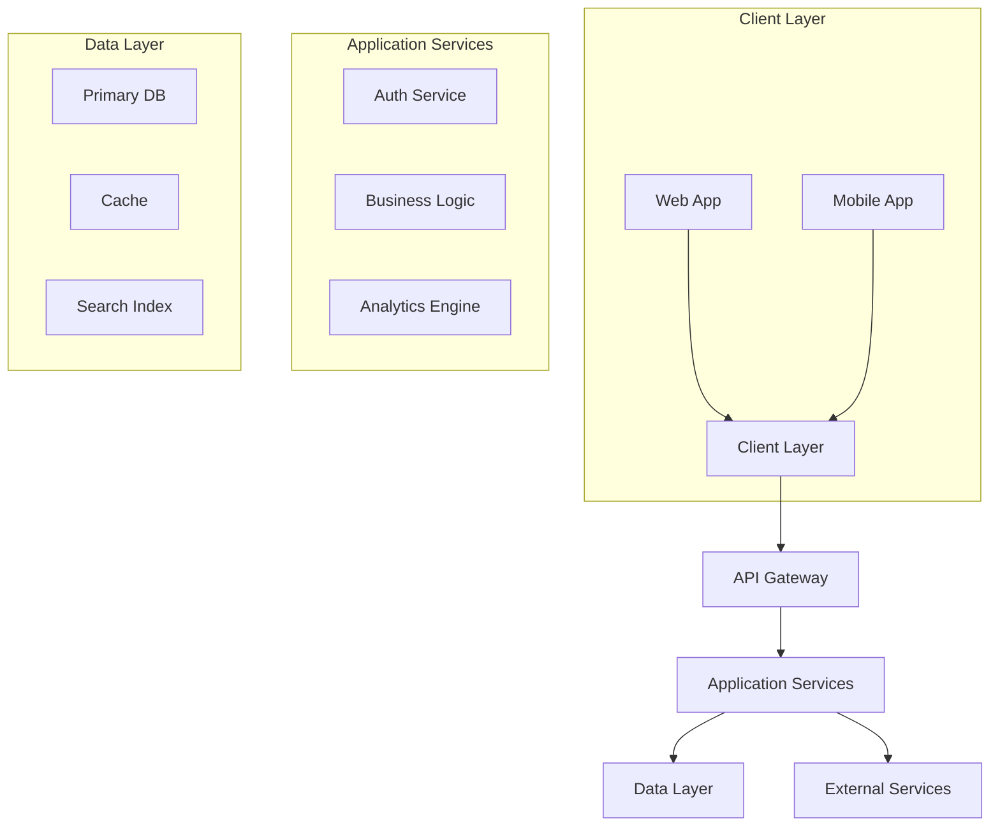

# IronCode Web - Enterprise SaaS Solution


[](https://github.com/tiation/ironcode-web/actions/workflows/main.yml)
[](LICENSE)
[](https://www.typescriptlang.org/)
[](https://reactjs.org/)

A robust, enterprise-grade web application built with modern technologies and best practices. Delivering high performance, security, and scalability for businesses.

## 🎲 Featured Projects

### DnD Dice Roller
A comprehensive virtual dice rolling platform for Dungeons & Dragons and tabletop gaming:

- 🎲 [dicerollerdnd.com](https://dicerollerdnd.com) - The Legendary Dice Roller for Heroes, Rogues & Dungeon Masters
- 🎯 [dnddiceroller.com](https://dnddiceroller.com) - Advanced online dice roller with custom dice sets and combinations

#### Mobile Apps
- 📱 [iOS App Store](https://apps.apple.com/app/dnd-dice-roller) (Coming Soon)
- 🤖 [Google Play Store](https://play.google.com/store/apps/details?id=com.tiation.dnddiceroller) (Coming Soon)

## 🌟 Features

- 🔐 Enterprise-grade Authentication & Authorization
- 📊 Real-time Analytics Dashboard
- 🔍 Advanced Search Capabilities
- 🌐 Multi-tenant Architecture
- 📱 Mobile-First Responsive Design
- 🚀 High Performance & Scalability
- 🔒 Security Best Practices
- 🌍 Internationalization Support
- 📈 Business Intelligence Tools
- 💳 Secure Payment Processing

## 🏗 Architecture



## 🚀 Quick Start

```bash
# Clone the repository
git clone https://github.com/tiation/ironcode-web.git

# Install dependencies
pnpm install

# Set up environment variables
cp .env.example .env

# Start development server
pnpm dev
```

## 📚 Documentation

- [API Documentation](./docs/api.md)
- [Development Guide](./docs/development.md)
- [Deployment Guide](./docs/deployment.md)
- [Contributing Guide](./CONTRIBUTING.md)

## 🔧 Technology Stack

- **Frontend**: React, TypeScript, Vite
- **Backend**: FastAPI, PostgreSQL
- **Infrastructure**: Docker, Kubernetes
- **CI/CD**: GitHub Actions
- **Monitoring**: Prometheus, Grafana
- **Analytics**: Mixpanel, PostHog

## 🤝 Enterprise Support

For enterprise inquiries and dedicated support:

**Contact**: Arnold Garrett  
**Email**: garrett@sxc.codes

## 📊 System Status

- [Status Page](https://status.ironcode.app)
- [System Metrics](https://metrics.ironcode.app)
- [API Status](https://api.ironcode.app/health)

## 🔒 Security

We take security seriously. View our [Security Policy](./SECURITY.md) for details about:

- Vulnerability Reporting
- Security Assessments
- Compliance Information
- Data Protection

## 📈 Performance

- 99.99% Uptime SLA
- <100ms API Response Time
- Global CDN Distribution
- Automatic Scaling

## 📱 Mobile Support

Fully optimized for mobile devices with:

- Responsive Design
- Touch-optimized Interface
- Native App Performance
- Offline Capabilities

## 🌟 Enterprise Features

- Role-based Access Control
- Audit Logging
- Data Encryption
- Compliance Tools
- SSO Integration
- API Rate Limiting
- Backup & Recovery
- 24/7 Support

## 📜 License

Copyright © 2025 IronCode Web. All rights reserved.

---

<p align="center">Built with ❤️ by the IronCode Team</p>
